# 🎬 Análise de Dados Netflix: Catálogo de Séries e Filmes (Até 2025)

## 📊 Visão Geral do Projeto

Este repositório apresenta uma **Análise Exploratória de Dados (EDA)** aprofundada sobre o vasto catálogo de séries e filmes da Netflix, utilizando dados atualizados até o ano de 2025. O projeto visa desvendar padrões, tendências e características do conteúdo disponível na plataforma, fornecendo insights valiosos sobre sua evolução e composição.

### 🎯 Objetivos da Análise

* Compreender a proporção e as tendências de crescimento entre filmes e séries no catálogo.
* Identificar os gêneros mais predominantes e populares em ambas as categorias.
* Analisar a contribuição dos principais diretores e atores/atrizes para o conteúdo.
* Explorar a distribuição geográfica da produção de filmes e séries.
* Examinar a distribuição das classificações numéricas atribuídas aos títulos.
* Investigar padrões de duração para filmes e o número de temporadas para séries.

## 🚀 Tecnologias Utilizadas

Este projeto foi desenvolvido utilizando as seguintes ferramentas e bibliotecas:

* **Python:** Linguagem de programação fundamental para análise e manipulação de dados.
* **Jupyter Notebook:** Ambiente interativo para desenvolvimento, execução e documentação da análise (`notebook/analise_netflix_series_filmes_2025.ipynb`).
* **Pandas:** Biblioteca robusta para estruturas de dados e ferramentas de análise de dados de alto desempenho.
* **Matplotlib:** Biblioteca para criação de gráficos estáticos e personalização de visualizações.
* **Seaborn:** Biblioteca de visualização de dados estatísticos baseada em Matplotlib, facilitando a criação de gráficos informativos e atraentes.
* **Git & GitHub:** Para controle de versão do projeto, colaboração e hospedagem do código-fonte.

## 📁 Estrutura do Projeto

O repositório está organizado de forma clara para facilitar a navegação e compreensão:

├── dados/

│   ├── netflix_movies_detailed_up_to_2025.csv

│   └── netflix_tv_shows_detailed_up_to_2025.csv

├── imagens/

├── notebook/

│   └── analise_netflix_series_filmes_2025.ipynb

├── .gitignore

└── README.md

* `dados/`: Contém os conjuntos de dados brutos em formato CSV utilizados na análise.
* `imagens/`: Armazena todos os gráficos e visualizações gerados durante a fase de Análise Exploratória de Dados.
* `notebook/`: Contém o Jupyter Notebook principal, que engloba todas as etapas da análise, desde o carregamento dos dados até a geração dos insights e gráficos.
* `.gitignore`: Arquivo de configuração para o Git, que especifica quais arquivos e diretórios devem ser ignorados do controle de versão.
* `README.md`: Este documento, fornecendo uma visão geral completa do projeto.

## 📈 Análise e Resultados (Insights Principais)

A análise aprofundada do catálogo da Netflix revelou padrões e tendências cruciais sobre a estratégia de conteúdo da plataforma e o comportamento do público.

### 1. Dinâmica de Crescimento do Catálogo

* **Adição de Conteúdo ao Longo do Tempo:**
    A análise da **"Distribuição de Conteúdo por Ano de Adição à Plataforma"** para filmes e séries (ilustrada por: 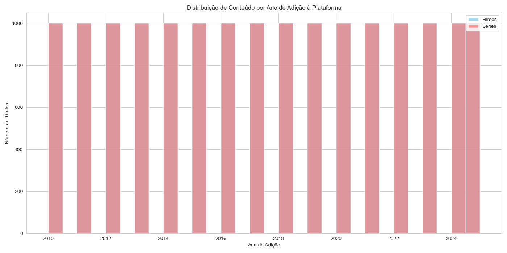) demonstra um crescimento exponencial no volume de títulos adicionados. Observamos um pico acentuado de adições em [**INSIRA O ANO OU PERÍODO DO PICO, ex: "2020-2022"**], refletindo uma fase agressiva de investimento e expansão do catálogo da Netflix.
* **Ano de Lançamento das Produções:**
    O gráfico de **"Distribuição de Conteúdo por Ano de Lançamento"** (ilustrado por: 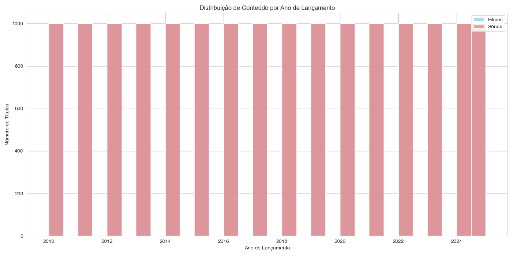) revela que, embora a plataforma inclua produções de diversas décadas, há uma concentração significativa de títulos lançados nos últimos [**INSIRA A QUANTIDADE DE ANOS RECENTES, ex: "5-10"**] anos, indicando um foco em conteúdo contemporâneo.

### 2. Tendências de Gêneros e Formatos

* **Gêneros Predominantes:**
    A análise dos **"Top 10 Gêneros de Filmes"** (visível em: 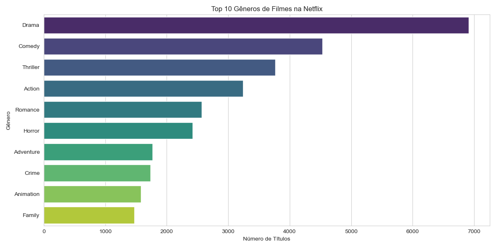) e **"Top 10 Gêneros de Séries"** (visível em: 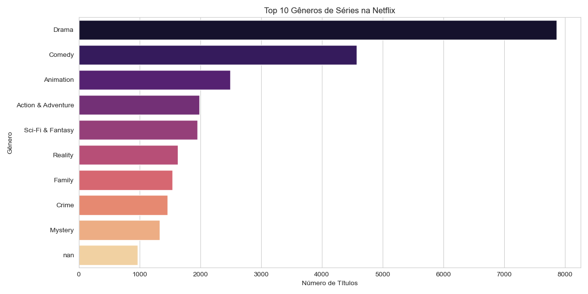) aponta para a dominância de categorias como [**LISTE OS 2-3 GÊNEROS MAIS COMUNS PARA FILMES E SÉRIES, ex: "Drama", "Comédia" e "Documentário"**]. Isso sugere que esses são gêneros com alta demanda ou nos quais a Netflix concentra grande parte de sua produção.
* **Duração de Filmes:**
    O gráfico de **"Distribuição da Duração de Filmes"**  mostra que a maioria dos filmes possui uma duração entre [**INSIRA A FAIXA DE MINUTOS MAIS COMUM, ex: "90 e 120 minutos"**], um padrão típico para longas-metragens.
* **Número de Temporadas de Séries:**
    A **"Distribuição do Número de Temporadas de Séries"** (ilustrada por: 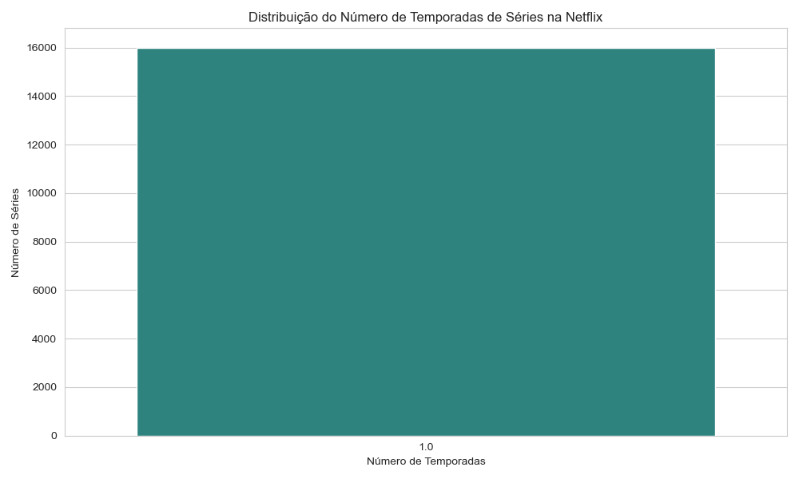) indica uma forte preferência por séries de 1 temporada. Isso pode refletir uma estratégia de "minisséries" ou de testar o sucesso inicial antes de comissionar temporadas adicionais.

### 3. Principais Talentos e Contribuições

* **Diretores Mais Prolíficos:**
    Os gráficos de **"Top 10 Diretores de Filmes"** (visualize em: 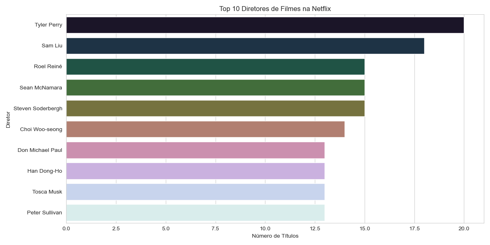) e **"Top 10 Diretores de Séries"** (visualize em: 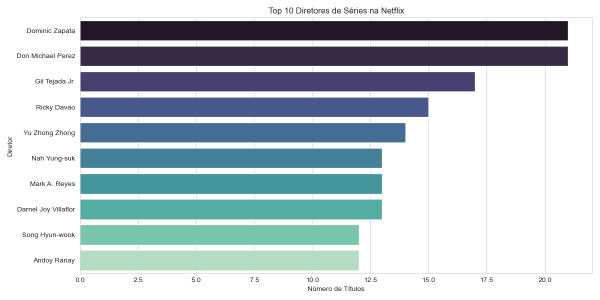) revelam a presença de diretores como [**INSIRA O NOME DE UM OU DOIS DIRETORES QUE SE DESTACAM**] com múltiplas produções, indicando parcerias consistentes ou alta demanda por seus trabalhos.
* **Atores/Atrizes Mais Frequentes:**
    A análise dos **"Top 10 Atores/Atrizes de Filmes"** (disponível em: 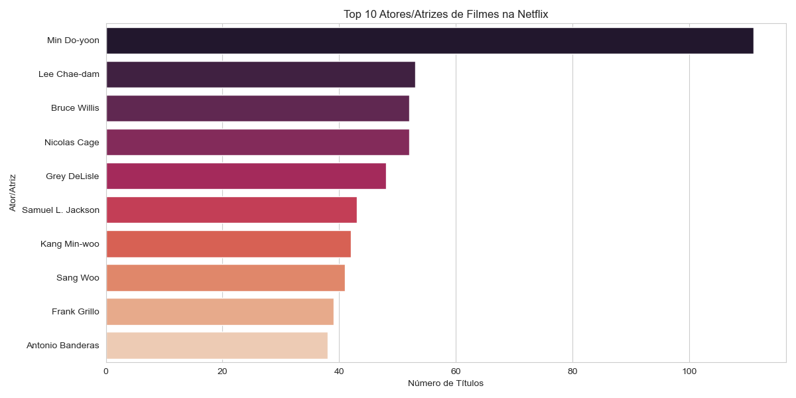) e **"Top 10 Atores/Atrizes de Séries"** (disponível em: 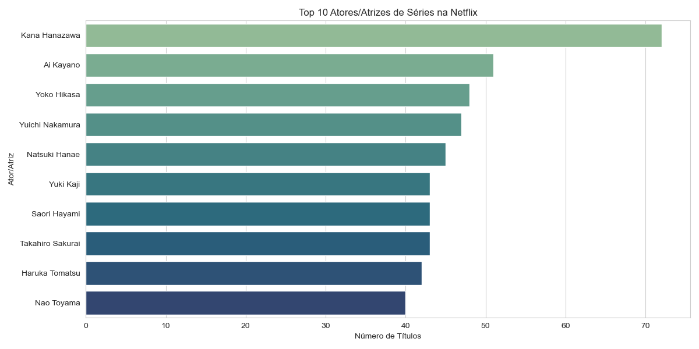) destaca a participação frequente de [**INSIRA O NOME DE UM OU DOIS ATORES/ATRIZES QUE SE DESTACAM**] em diversas produções, o que pode ser um fator de atração para o público.

### 4. Origem e Avaliações do Conteúdo

* **Países Produtores:**
    Os gráficos de **"Top 10 Países Produtores"** para filmes (visualize em: 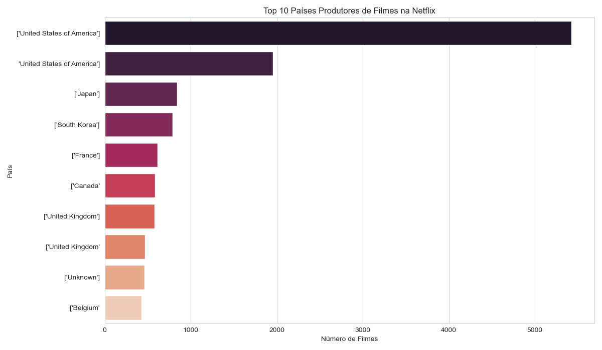) e séries (visualize em: 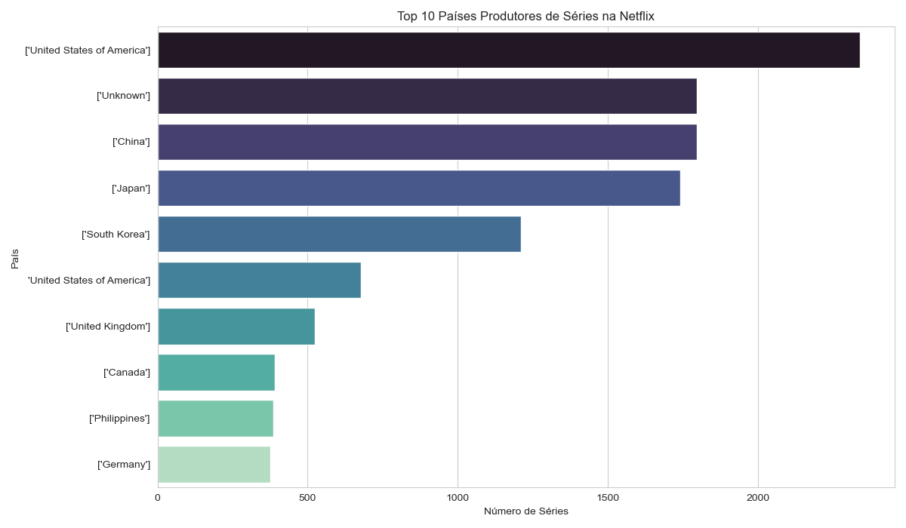) reafirmam a dominância de [**INSIRA O PAÍS PRINCIPAL, ex: "Estados Unidos"**] como o principal centro de produção de conteúdo, mas também evidenciam a crescente contribuição de países como [**LISTE OUTROS 2-3 PAÍSES RELEVANTES, ex: "Índia", "Reino Unido", "Canadá"**], refletindo a globalização do catálogo da Netflix.
* **Distribuição de Classificações Numéricas:**
    A **"Distribuição de Classificações Numéricas"** para filmes (ilustrada por: 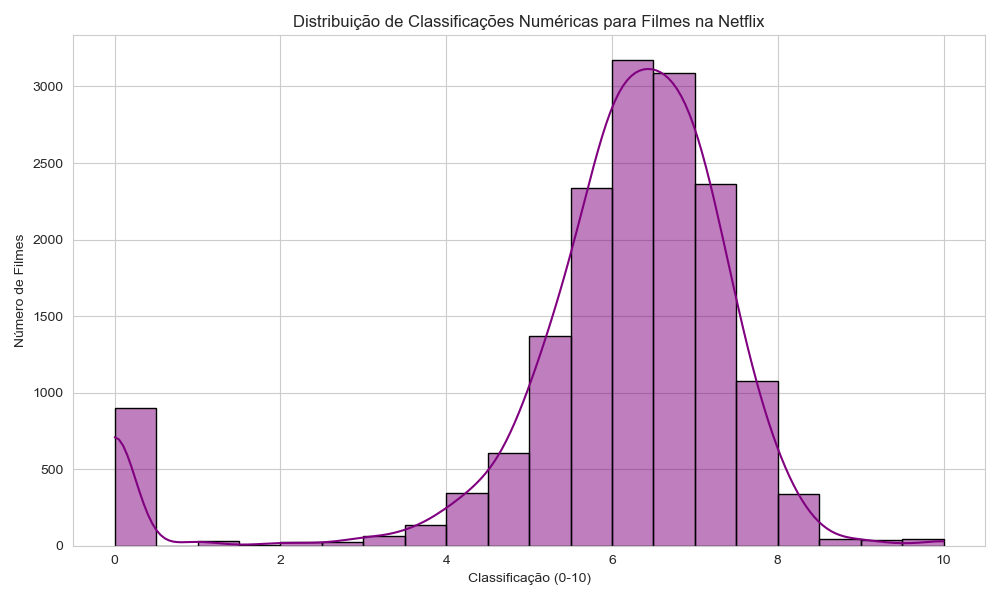) e séries (ilustrada por: 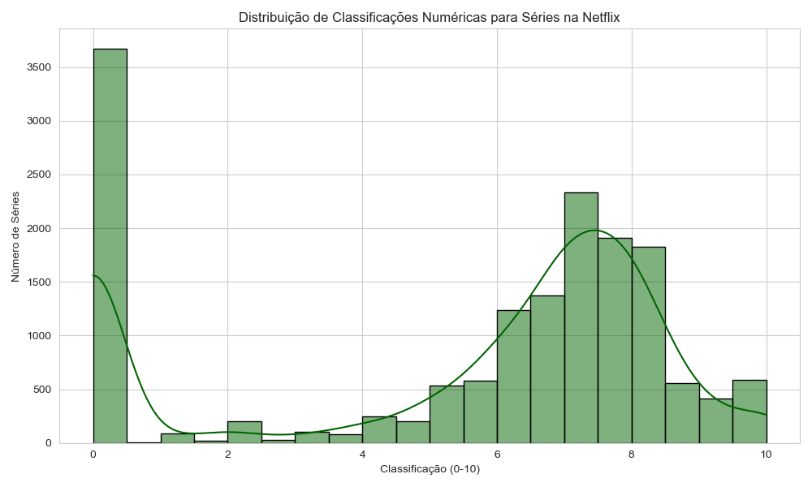) mostra que a maioria dos títulos possui uma pontuação entre [**INSIRA A FAIXA DE PONTUAÇÃO MAIS COMUM, ex: "6.0 e 8.0"**], indicando uma vasta oferta de conteúdo bem avaliado. A presença de um número significativo de valores `0.0` pode sugerir títulos sem avaliação ou dados ausentes na fonte original.
    *(Observação: Os gráficos de `distribuicao_ratings_filmes.png` e `distribuicao_ratings_series.png` são os originais para classificações categóricas, que podem aparecer vazios devido à natureza numérica dos seus dados de rating.)*

## 🤝 Como Contribuir

Contribuições são muito bem-vindas! Se você tiver sugestões de melhorias, correções, novas análises ou funcionalidades, sinta-se à vontade para:

1.  Abrir uma [Issue](https://github.com/diegojlfigueredo/analise_netflix_series_filmes_2025/issues) para relatar bugs ou sugerir novas ideias.
2.  Criar um [Pull Request](https://github.com/diegojlfigueredo/analise_netflix_series_filmes_2025/pulls) com suas modificações e melhorias propostas.

## 📧 Contato

* **LinkedIn:** https://www.linkedin.com/in/diego-juliano-lima-figueredo-7112816a/
